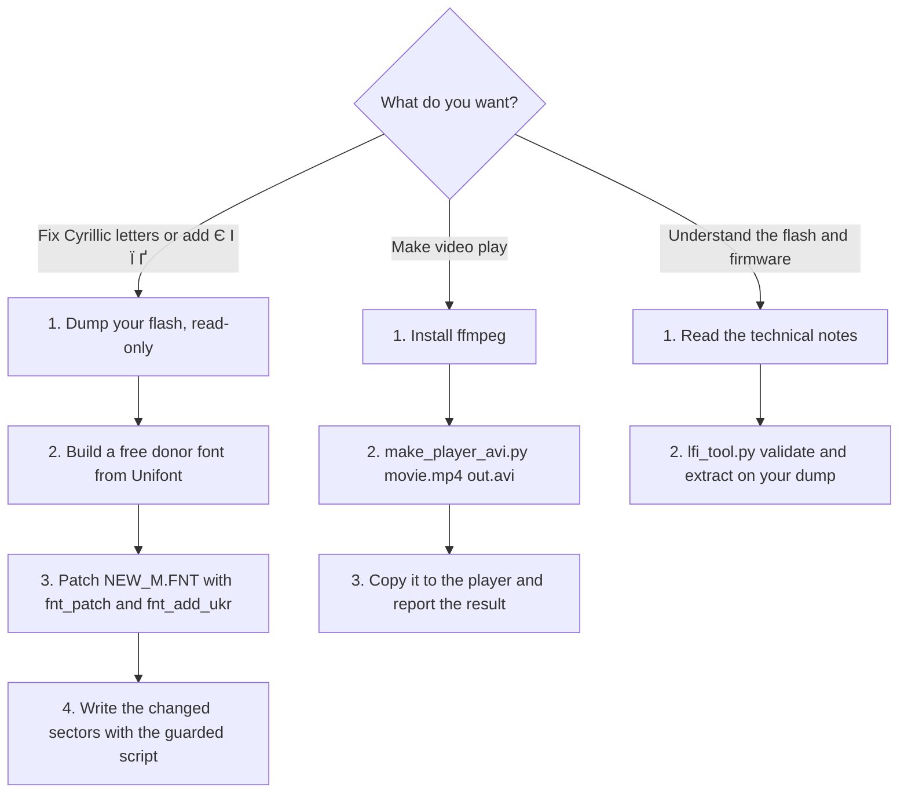

# ATJ2157 player toolkit

[](https://github.com/zanzipanzi/atj2157-player-toolkit/actions/workflows/tests.yml)

Reverse-engineering notes and tools for cheap **Actions ATJ2157** "iPod-nano clone" MP3/MP4 players (ARM Cortex-M4F,
GD25Q32 SPI flash, microSD media). Born from a practical problem: the player could not show Russian text properly
(letters were drawn in a CJK-width cell) and had no Ukrainian letters; later someone with the same player asked why
no video would open.

**English** | [Українська](README.uk.md) | [Русский](README.ru.md)

Technical notes: [EN](docs/technical-notes.md) · [UK](docs/technical-notes.uk.md) · [RU](docs/technical-notes.ru.md) ·
Where to get everything: [EN](docs/where-to-get.md) · [UK](docs/where-to-get.uk.md) · [RU](docs/where-to-get.ru.md) ·
[Compatibility](docs/compatibility.md) · [Safety](SAFETY.md)

## Quick start: what do you want to do?



- **Fonts:** [where to get everything](docs/where-to-get.md), then [technical notes, sections 4-8](docs/technical-notes.md). Read [SAFETY.md](SAFETY.md) first.
- **Video:** [short answer below](#why-the-video-does-not-open-short-answer), details in [technical notes, section 9](docs/technical-notes.md).
- **Just curious:** start with the [technical notes](docs/technical-notes.md).

## What is in here

| Part | What it gives you |
|---|---|
| [`docs/technical-notes.md`](docs/technical-notes.md) | ADFU service-mode protocol, memory map, boot ROM, SPI controller, **the flash scrambler** (read bit `0x1000`, write bit `0x2000`, the 512-byte-stream trick), write protection and how to lift it volatilely, LFI firmware format, `NEW_M.FNT` font format, video requirements |
| [`docs/where-to-get.md`](docs/where-to-get.md) | verified links and commands for every tool and file you need (this repository ships none of them) |
| [`docs/compatibility.md`](docs/compatibility.md) | which players were tested and what worked |
| [`payload/`](payload) | C payloads that run on the chip (read / status / guarded write) and the shell drivers around them |
| [`tools/lfi_tool.py`](tools/lfi_tool.py), [`lfi_replace.py`](tools/lfi_replace.py) | validate / unpack the firmware directory; replace a same-size file and fix the checksums |
| [`tools/fnt_patch.py`](tools/fnt_patch.py), [`fnt_add_ukr.py`](tools/fnt_add_ukr.py) | narrow Cyrillic glyphs + Ukrainian `Є І Ї Ґ` in `NEW_M.FNT` without changing the file size |
| [`tools/make_donor_from_unifont.py`](tools/make_donor_from_unifont.py) | builds the donor font for the two tools above from free GNU Unifont, so no vendor font is needed |
| [`tools/make_player_avi.py`](tools/make_player_avi.py) | convert any video into the exact AVI (or AMV) layout the player's video module accepts |
| [`tools/mmm_vp_walker_emu.py`](tools/mmm_vp_walker_emu.py) | run the player's **own** AVI/AMV header parser under the Unicorn CPU emulator on your file |

Each release also carries **prebuilt read-only payloads** (`spiid`, `spistat`, `spiread`) with a `SHA256SUMS` file, built by CI
from this source, so you can dump your flash without installing a compiler. The writing payload (`spiwrite`) is deliberately
source-only: build it yourself and read what it does.

## Why the video does not open (short answer)

The player decodes **only MJPEG**, in **AVI** or **AMV**. For AVI the firmware also insists that bytes 342..345 of the file
are `AVI1`, i.e. the first JPEG frame starts at byte 336 and carries an `AVI1` marker. ffmpeg's normal AVI does not
(frame at byte ~10 000, `JFIF` marker), and the player then **silently refuses** the file. `tools/make_player_avi.py`
re-muxes the streams into the right layout:

```
pip install -r requirements.txt            # optional: only for the emulator check and tests
python tools/make_player_avi.py movie.mp4 for_player.avi --size 160x128 --fps 15
python tools/make_player_avi.py movie.mp4 for_player.amv --format amv --size 160x112
```

Status: this is verified against the firmware's own header parser (emulated) and decodes in ffmpeg, but it has
**not been tried on a real player yet**. If you have one, please open an issue with the result.

## What is NOT in this repository (on purpose)

- No firmware, ROM dumps, flash images or unpacked firmware files: they are the vendor's copyrighted code and carry
  identifiers of one device. Dump **your own** player ([where to get everything](docs/where-to-get.md)).
- No donor font. Build a free one from GNU Unifont, or see the other options in [where to get everything](docs/where-to-get.md).
- No photos or media.

## Requirements

Python 3.10+; for the chip-side parts a Linux host with `arm-none-eabi-gcc` and the
[actions_flash](https://github.com/ilyakurdyukov/actions_flash) `actions_dump` tool; `ffmpeg` for the video tool.

## Tested on, and limits

One unit: ATJ2157, GD25Q32, firmware version string `1.101.56`, 1.8"-class screen. Everything marked
**(unverified)** in the notes was not confirmed on hardware. Other units with the same chip may differ. Please read
[SAFETY.md](SAFETY.md) before running any write.

## Reports from real players are welcome

Most of this was verified on one unit, and the video converter has not been tried on a real player yet. If you have an ATJ2157 (or
similar) player, please [send a hardware test report](https://github.com/zanzipanzi/atj2157-player-toolkit/issues/new?template=hardware-report.yml): failures are as useful as successes. See
[CONTRIBUTING.md](CONTRIBUTING.md) (never attach firmware or dumps).

## License

Code: MIT ([LICENSE](LICENSE)). Documentation and charts: CC BY 4.0. Credits: see the end of the technical notes.
