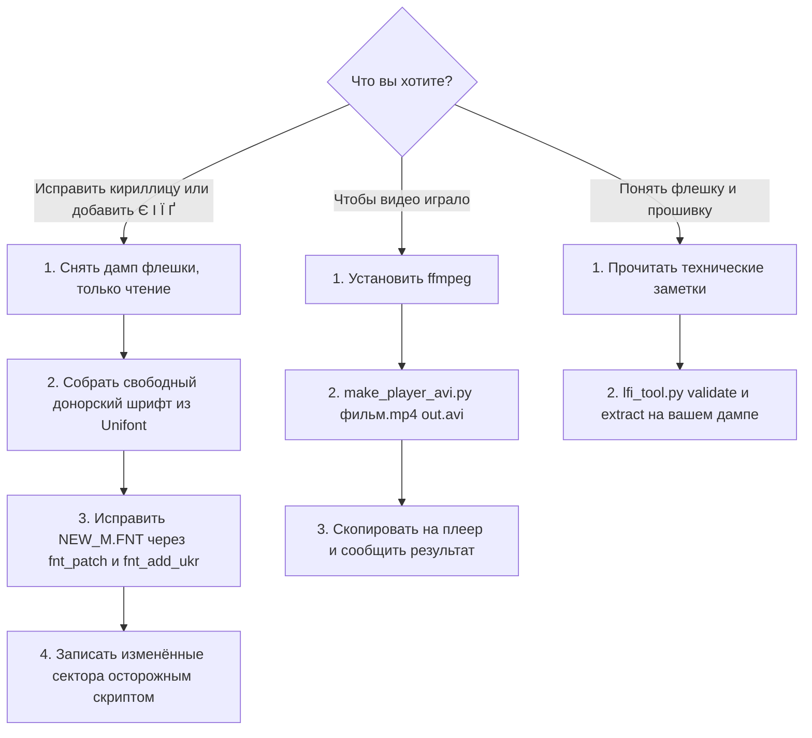

# Набор инструментов для плееров на ATJ2157

[](https://github.com/zanzipanzi/atj2157-player-toolkit/actions/workflows/tests.yml)

Заметки и инструменты по дешёвым плеерам-«клонам iPod nano» на чипе **Actions ATJ2157** (ARM Cortex-M4F, SPI-флешка
GD25Q32, медиа на microSD). Всё началось с практической задачи: плеер некорректно показывал русский текст (буквы рисовались
в ячейке иероглифа и шли «вразрядку») и не знал украинских букв; потом человек с таким же плеером спросил, почему не
открывается видео.

[English](README.md) | [Українська](README.uk.md) | **Русский**

Технические заметки: [EN](docs/technical-notes.md) · [UK](docs/technical-notes.uk.md) · [RU](docs/technical-notes.ru.md) ·
Где взять всё нужное: [EN](docs/where-to-get.md) · [UK](docs/where-to-get.uk.md) · [RU](docs/where-to-get.ru.md) ·
[Совместимость](docs/compatibility.md) · [Безопасность](SAFETY.md)

## Быстрый старт: что вы хотите сделать?



- **Шрифты:** [где взять всё нужное](docs/where-to-get.ru.md), затем [технические заметки, разделы 4-8](docs/technical-notes.ru.md). Сначала прочитайте [SAFETY.md](SAFETY.md).
- **Видео:** [короткий ответ ниже](#почему-видео-не-открывается-коротко), подробности в [технических заметках, раздел 9](docs/technical-notes.ru.md).
- **Просто интересно:** начните с [технических заметок](docs/technical-notes.ru.md).

## Что здесь есть

| Часть | Что даёт |
|---|---|
| [`docs/technical-notes.ru.md`](docs/technical-notes.ru.md) | протокол сервисного режима ADFU, карта памяти, загрузочное ПЗУ, контроллер SPI, **шифрование флешки** (бит чтения `0x1000`, бит записи `0x2000`, приём с потоком в 512 байт), защита записи и её временное снятие, формат прошивки LFI, формат шрифта `NEW_M.FNT`, требования к видео |
| [`docs/where-to-get.ru.md`](docs/where-to-get.ru.md) | проверенные ссылки и команды для каждого нужного инструмента и файла (в этом репозитории их нет) |
| [`docs/compatibility.md`](docs/compatibility.md) | какие плееры проверены и что сработало |
| [`payload/`](payload) | программы на C, которые выполняются в чипе (чтение, статус, осторожная запись), и shell-скрипты вокруг них |
| [`tools/lfi_tool.py`](tools/lfi_tool.py), [`lfi_replace.py`](tools/lfi_replace.py) | проверка и распаковка каталога прошивки; замена файла того же размера с пересчётом сумм |
| [`tools/fnt_patch.py`](tools/fnt_patch.py), [`fnt_add_ukr.py`](tools/fnt_add_ukr.py) | узкие русские буквы и украинские `Є І Ї Ґ` в `NEW_M.FNT` без изменения размера файла |
| [`tools/make_donor_from_unifont.py`](tools/make_donor_from_unifont.py) | собирает донорский шрифт для двух инструментов выше из свободного GNU Unifont, так что шрифт производителя не нужен |
| [`tools/make_player_avi.py`](tools/make_player_avi.py) | конвертер любого видео в точную раскладку AVI (или AMV), которую принимает видеомодуль плеера |
| [`tools/mmm_vp_walker_emu.py`](tools/mmm_vp_walker_emu.py) | запускает **настоящий** разбор заголовка AVI/AMV из прошивки плеера в эмуляторе процессора Unicorn на вашем файле |

К каждому релизу приложены **готовые программы только для чтения** (`spiid`, `spistat`, `spiread`) с файлом `SHA256SUMS`, собранные CI
из этого кода, чтобы снять дамп флешки без компилятора. Программа записи (`spiwrite`) намеренно отдана только исходниками:
собирайте сами и читайте, что она делает.

## Почему видео не открывается (коротко)

Плеер декодирует **только MJPEG**, в контейнерах **AVI** или **AMV**. Для AVI прошивка ещё и требует, чтобы в байтах
342..345 файла стояло `AVI1`: первый JPEG-кадр должен начинаться с 336-го байта и нести метку `AVI1`. Обычный AVI от ffmpeg
такого не даёт (кадр на ~10 000-м байте, метка `JFIF`), и плеер такой файл **молча отвергает**: в списке файл есть, а
воспроизведения нет. Важна именно раскладка заголовка, а не выбор кодека, поэтому перебор кодеков внутри AVI не поможет.
`tools/make_player_avi.py` пересобирает потоки в нужную раскладку:

```
pip install -r requirements.txt            # необязательно: только для проверки эмулятором и тестов
python tools/make_player_avi.py фильм.mp4 для_плеера.avi --size 160x128 --fps 15
python tools/make_player_avi.py фильм.mp4 для_плеера.amv --format amv --size 160x112
```

Статус: проверено разбором заголовка из самой прошивки (в эмуляторе) и декодируется в ffmpeg, но **на настоящем плеере ещё не
пробовали**. Если у вас такой плеер, напишите в issue, что получилось.

## Чего здесь нет (специально)

- Нет прошивки, дампов ПЗУ, образов флешки и распакованных файлов прошивки: это защищённый авторским правом код
  производителя, и он содержит идентификаторы конкретного экземпляра. Снимайте дамп **своего** плеера ([где взять всё нужное](docs/where-to-get.ru.md)).
- Нет донорского шрифта. Соберите свободный из GNU Unifont или смотрите другие варианты в [где взять всё нужное](docs/where-to-get.ru.md).
- Нет фотографий и медиафайлов.

## Установка командами (необязательно)

Всё можно запускать прямо из клона (`python tools/<имя>.py`). Чтобы получить короткие команды:

```
pipx install "git+https://github.com/zanzipanzi/atj2157-player-toolkit.git"
# или, чтобы конвертер видео ещё и проверял файл разбором из прошивки (нужен пакет Unicorn):
pipx install "atj2157-player-toolkit[emulator] @ git+https://github.com/zanzipanzi/atj2157-player-toolkit.git"
```

(В виртуальном окружении так же работает обычный `pip install`.) Каждая команда - это скрипт с тем же названием:

| Команда | Скрипт |
|---|---|
| `atj2157-lfi` | `tools/lfi_tool.py` |
| `atj2157-lfi-replace` | `tools/lfi_replace.py` |
| `atj2157-fnt-patch` | `tools/fnt_patch.py` |
| `atj2157-fnt-add-ukr` | `tools/fnt_add_ukr.py` |
| `atj2157-font-transplant` | `tools/font_transplant.py` |
| `atj2157-donor-from-unifont` | `tools/make_donor_from_unifont.py` |
| `atj2157-make-avi` | `tools/make_player_avi.py` |
| `atj2157-vp-check` | `tools/mmm_vp_walker_emu.py` |

Пакета на PyPI нет. Программы для чипа из `payload/` в него не входят (им нужен кросс-компилятор C): берите готовые, только для чтения, из каждого релиза.

## Требования

Python 3.10+; для частей, работающих с чипом, Linux с `arm-none-eabi-gcc` и утилитой `actions_dump` из проекта
[actions_flash](https://github.com/ilyakurdyukov/actions_flash); `ffmpeg` для видео-инструмента.

## На чём проверено и ограничения

Один экземпляр: ATJ2157, GD25Q32, строка версии прошивки `1.101.56`, экран класса 1,8". Всё, что в заметках помечено
**(unverified)**, на железе не подтверждено. У других плееров с тем же чипом может быть иначе. Прочитайте
[SAFETY.md](SAFETY.md) до любой записи.

## Отчёты с настоящих плееров приветствуются

Большая часть проверена на одном экземпляре, а конвертер видео на настоящем плеере ещё не пробовали. Если у вас есть ATJ2157
(или похожий) плеер, пришлите [отчёт о проверке](https://github.com/zanzipanzi/atj2157-player-toolkit/issues/new?template=hardware-report.yml): неудачи так же полезны, как удачи. См.
[CONTRIBUTING.md](CONTRIBUTING.md) (никогда не прикладывайте прошивки и дампы).

## Лицензия

Код: MIT ([LICENSE](LICENSE)). Документация и графики: CC BY 4.0. Благодарности: в конце технических заметок.
