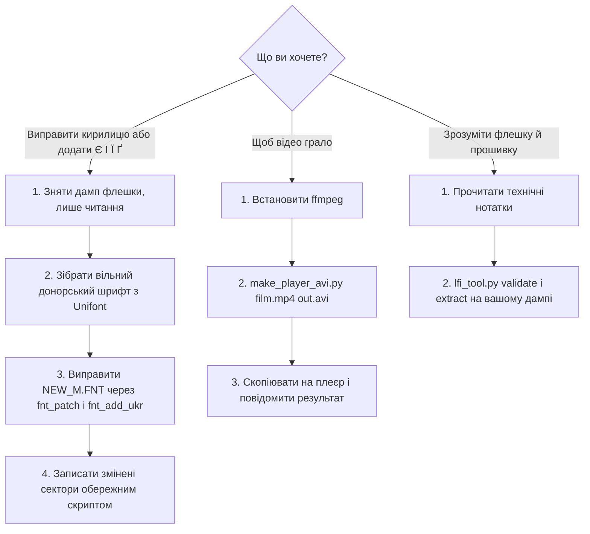

# Набір інструментів для плеєрів на ATJ2157

[](https://github.com/zanzipanzi/atj2157-player-toolkit/actions/workflows/tests.yml)

Нотатки та інструменти для дешевих плеєрів-«клонів iPod nano» на чипі **Actions ATJ2157** (ARM Cortex-M4F, SPI-флешка
GD25Q32, медіа на microSD). Усе почалося з практичної задачі: плеєр некоректно показував російський текст (літери малювалися
в комірці ієрогліфа й ішли «врозбіг») і не знав українських літер; потім людина з таким самим плеєром запитала, чому не
відкривається відео.

[English](README.md) | **Українська** | [Русский](README.ru.md)

Технічні нотатки: [EN](docs/technical-notes.md) · [UK](docs/technical-notes.uk.md) · [RU](docs/technical-notes.ru.md) ·
Де взяти все потрібне: [EN](docs/where-to-get.md) · [UK](docs/where-to-get.uk.md) · [RU](docs/where-to-get.ru.md) ·
[Сумісність](docs/compatibility.md) · [Безпека](SAFETY.md)

## Швидкий старт: що ви хочете зробити?



- **Шрифти:** [де взяти все потрібне](docs/where-to-get.uk.md), далі [технічні нотатки, розділи 4-8](docs/technical-notes.uk.md). Спершу прочитайте [SAFETY.md](SAFETY.md).
- **Відео:** [коротка відповідь нижче](#чому-відео-не-відкривається-коротко), подробиці в [технічних нотатках, розділ 9](docs/technical-notes.uk.md).
- **Просто цікаво:** почніть з [технічних нотаток](docs/technical-notes.uk.md).

## Що тут є

| Частина | Що дає |
|---|---|
| [`docs/technical-notes.uk.md`](docs/technical-notes.uk.md) | протокол сервісного режиму ADFU, карта пам'яті, завантажувальне ПЗП, контролер SPI, **шифрування флешки** (біт читання `0x1000`, біт запису `0x2000`, прийом із потоком у 512 байт), захист запису та його тимчасове зняття, формат прошивки LFI, формат шрифту `NEW_M.FNT`, вимоги до відео |
| [`docs/where-to-get.uk.md`](docs/where-to-get.uk.md) | перевірені посилання й команди для кожного потрібного інструмента й файла (у цьому репозиторії їх немає) |
| [`docs/compatibility.md`](docs/compatibility.md) | які плеєри перевірено й що спрацювало |
| [`payload/`](payload) | програми на C, що виконуються в чипі (читання, статус, обережний запис), та shell-скрипти навколо них |
| [`tools/lfi_tool.py`](tools/lfi_tool.py), [`lfi_replace.py`](tools/lfi_replace.py) | перевірка й розпакування каталогу прошивки; заміна файлу того самого розміру з перерахунком сум |
| [`tools/fnt_patch.py`](tools/fnt_patch.py), [`fnt_add_ukr.py`](tools/fnt_add_ukr.py) | вузькі російські літери та українські `Є І Ї Ґ` у `NEW_M.FNT` без зміни розміру файлу |
| [`tools/make_donor_from_unifont.py`](tools/make_donor_from_unifont.py) | збирає донорський шрифт для двох інструментів вище з вільного GNU Unifont, тож шрифт виробника не потрібен |
| [`tools/make_player_avi.py`](tools/make_player_avi.py) | конвертер будь-якого відео в точне розташування AVI (або AMV), яке приймає відеомодуль плеєра |
| [`tools/mmm_vp_walker_emu.py`](tools/mmm_vp_walker_emu.py) | запускає **справжній** розбір заголовка AVI/AMV із прошивки плеєра в емуляторі процесора Unicorn на вашому файлі |

До кожного релізу додано **готові програми лише для читання** (`spiid`, `spistat`, `spiread`) із файлом `SHA256SUMS`, зібрані CI
з цього коду, щоб зняти дамп флешки без компілятора. Програму запису (`spiwrite`) навмисно віддано лише вихідним кодом:
збирайте самі й читайте, що вона робить.

## Чому відео не відкривається (коротко)

Плеєр декодує **лише MJPEG**, у контейнерах **AVI** або **AMV**. Для AVI прошивка ще й вимагає, щоб у байтах 342..345 файлу
стояло `AVI1`: перший JPEG-кадр має починатися з 336-го байта й нести мітку `AVI1`. Звичайний AVI від ffmpeg такого не дає
(кадр на ~10 000-му байті, мітка `JFIF`), і плеєр такий файл **мовчки відхиляє**: у списку файл є, а не відкривається.
Тут важить саме розташування заголовка, а не вибір кодека, тому перебирання кодеків усередині AVI не допоможе.
`tools/make_player_avi.py` перебирає потоки в потрібне розташування:

```
pip install -r requirements.txt            # необов'язково: лише для перевірки емулятором і тестів
python tools/make_player_avi.py film.mp4 for_player.avi --size 160x128 --fps 15
python tools/make_player_avi.py film.mp4 for_player.amv --format amv --size 160x112
```

Статус: перевірено розбором заголовка з самої прошивки (в емуляторі) і файл декодується в ffmpeg, але **на справжньому плеєрі
ще не пробували**. Якщо у вас такий плеєр, напишіть в issue, що вийшло.

## Чого тут немає (навмисно)

- Немає прошивки, дампів ПЗП, образів флешки та розпакованих файлів прошивки: це захищений авторським правом код виробника,
  і він містить ідентифікатори конкретного екземпляра. Знімайте дамп **свого** плеєра ([де взяти все потрібне](docs/where-to-get.uk.md)).
- Немає донорського шрифту. Зберіть вільний із GNU Unifont або дивіться інші варіанти в [де взяти все потрібне](docs/where-to-get.uk.md).
- Немає фотографій і медіафайлів.

## Встановлення командами (необов'язково)

Усе можна запускати прямо з клона (`python tools/<ім'я>.py`). Щоб мати короткі команди:

```
pipx install "git+https://github.com/zanzipanzi/atj2157-player-toolkit.git"
# або, щоб конвертер відео ще й перевіряв файл розбором із прошивки (потрібен пакет Unicorn):
pipx install "atj2157-player-toolkit[emulator] @ git+https://github.com/zanzipanzi/atj2157-player-toolkit.git"
```

(У віртуальному середовищі так само працює звичайний `pip install`.) Кожна команда - це скрипт із тією самою назвою:

| Команда | Скрипт |
|---|---|
| `atj2157-lfi` | `tools/lfi_tool.py` |
| `atj2157-lfi-replace` | `tools/lfi_replace.py` |
| `atj2157-fnt-patch` | `tools/fnt_patch.py` |
| `atj2157-fnt-add-ukr` | `tools/fnt_add_ukr.py` |
| `atj2157-font-transplant` | `tools/font_transplant.py` |
| `atj2157-donor-from-unifont` | `tools/make_donor_from_unifont.py` |
| `atj2157-make-avi` | `tools/make_player_avi.py` |
| `atj2157-vp-check` | `tools/mmm_vp_walker_emu.py` |

Пакета на PyPI немає. Програми для чипа з `payload/` до нього не входять (їм потрібен кросс-компілятор C): беріть готові, лише для читання, з кожного релізу.

## Вимоги

Python 3.10+; для частин, що працюють із чипом, Linux з `arm-none-eabi-gcc` і утилітою `actions_dump` з проєкту
[actions_flash](https://github.com/ilyakurdyukov/actions_flash); `ffmpeg` для відео-інструмента.

## На чому перевірено й обмеження

Один екземпляр: ATJ2157, GD25Q32, рядок версії прошивки `1.101.56`, екран класу 1,8". Усе, що в нотатках позначено
**(unverified)**, на залізі не підтверджено. В інших плеєрів з тим самим чипом може бути інакше. Прочитайте
[SAFETY.md](SAFETY.md) до будь-якого запису.

## Звіти зі справжніх плеєрів вітаються

Більшу частину перевірено на одному екземплярі, а конвертер відео на справжньому плеєрі ще не пробували. Якщо у вас є ATJ2157
(або схожий) плеєр, надішліть [звіт про перевірку](https://github.com/zanzipanzi/atj2157-player-toolkit/issues/new?template=hardware-report.yml): невдачі так само корисні, як удачі. Див.
[CONTRIBUTING.md](CONTRIBUTING.md) (ніколи не додавайте прошивки й дампи).

## Ліцензія

Код: MIT ([LICENSE](LICENSE)). Документація та графіки: CC BY 4.0. Подяки: наприкінці технічних нотаток.
