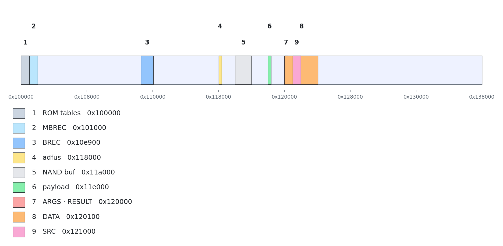
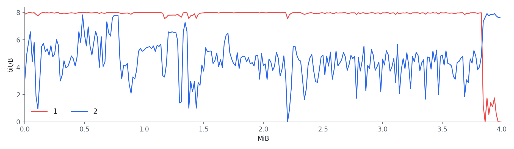
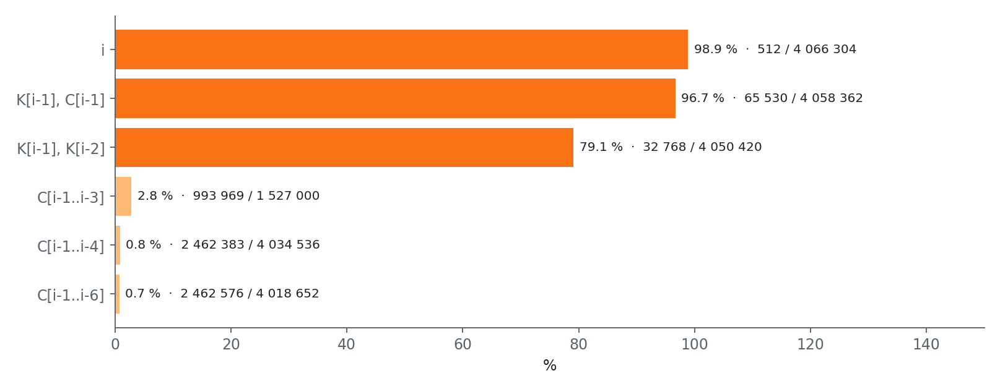
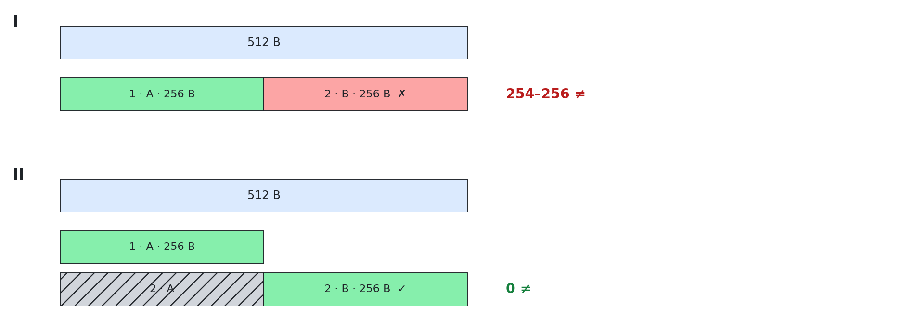
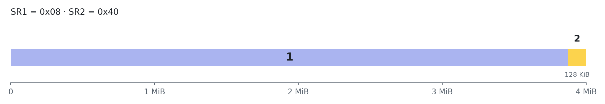
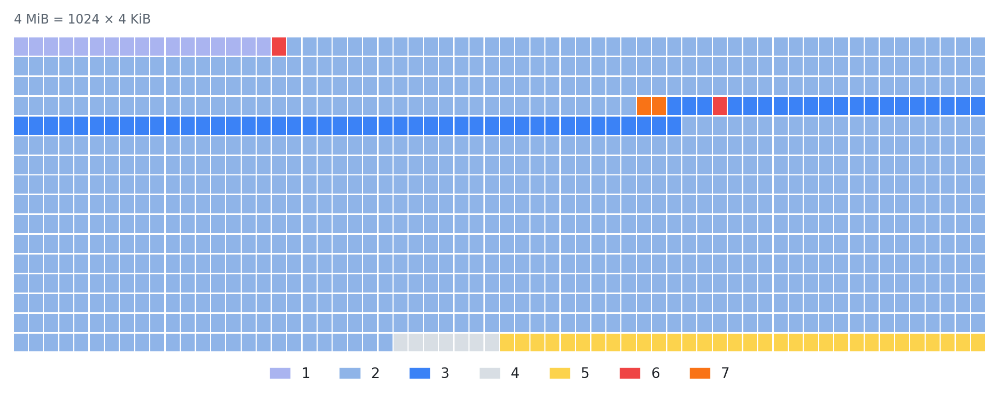
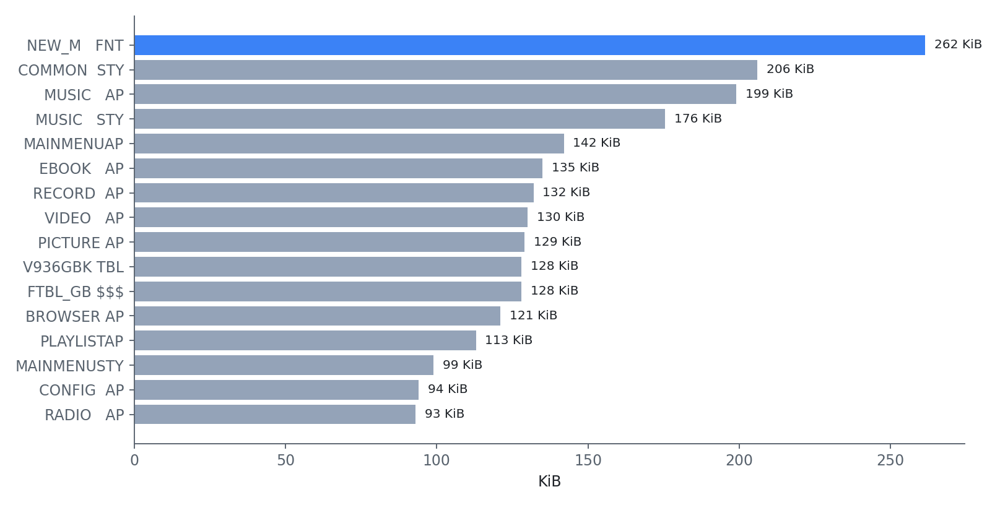
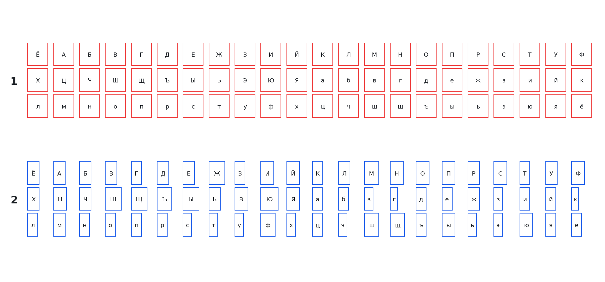
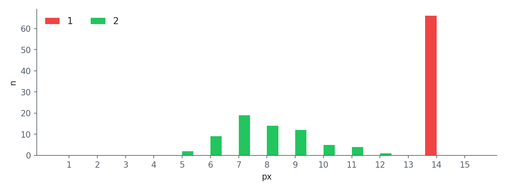
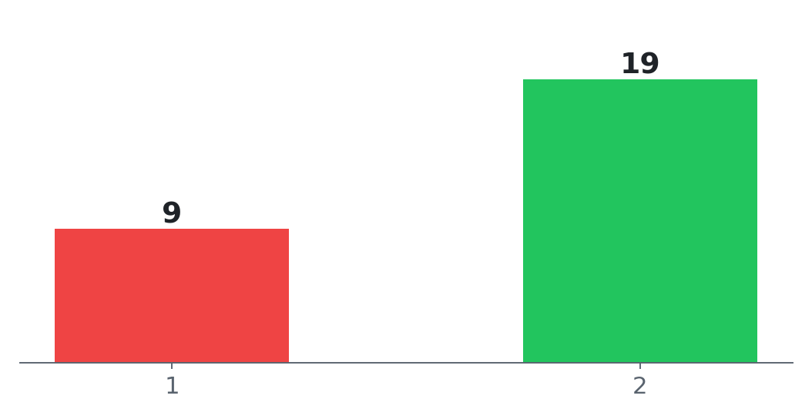

# Технічні нотатки: плеєри-«клони iPod nano» на Actions ATJ2157

Усе тут виміряно на **одному** екземплярі (звичайний MP3/MP4-плеєр на чипі Actions **ATJ2157**, ARM Cortex-M4F, прошивка
на SPI-флешці **GD25Q32** на 4 МіБ, медіа на microSD, рядок версії прошивки `1.101.56`). В інших плеєрів з тим самим чипом,
імовірно, схоже, але гарантій немає. Позначка **(unverified)** означає, що висновок зроблено за читанням коду або документації
й на залізі не підтверджено.

Інші мови: [English](technical-notes.md), [Русский](technical-notes.ru.md). На графіках лише числа й адреси, пояснення до них
подано текстом під кожною картинкою. Де взяти потрібні інструменти й файли: [where-to-get.uk.md](where-to-get.uk.md).

## 1. Як упізнати пристрій

| Режим | USB id | Що видно |
|---|---|---|
| звичайний | `10d6:1101` | флешка, `ACTIONS USB DISK FOB 2.0`; `lsusb` може назвати її «D-Wave 2GB MP4 Player / AK1025» (старий запис у базі з тим самим id, це **не** визначення чипа) |
| сервісний режим ADFU | `10d6:10d6` | протокол оновлення прошивки Actions, файлової системи немає |

Надійно визначити чип можна лише за відповіддю `adfu_info` у режимі ADFU: байти `00 'CADFUD' 30 51`, де `0x3051` означає
ATJ2157 (схожий ATJ2127 відповідає інакше). Пошук за наклейкою передбачив для цього плеєра не той чип, тому перевіряйте до
завантаження будь-якого коду.

**Вхід в ADFU.** На перевіреному екземплярі: перемикач у положенні OFF, затиснути **центральну кнопку**, підключити USB.
Програмна команда `adfu_reboot` (службові CDB `0xCC`, потім `0xCB 0x21`) працює і зі звичайного режиму. Вихід з ADFU:
від'єднати кабель, перемикач OFF і знову ON, за потреби затиснути центр і MENU; програмний `reset` з ADFU повертав у ADFU.
Програма, що зависла в сервісному режимі, може залишити плеєр «мертвим» до розрядження батареї, тому знайдіть апаратну кнопку
входу **до** того, як запускати щось, що пише.

## 2. Протокол ADFU і карта пам'яті

USB Mass Storage (bulk-only) зі службовими командами. CDB `0xCD` несе підкоманду:

| Підкоманда | Зміст |
|---|---|
| `0x13` WRITERAM | записати байти в ОЗП чипа |
| `0x93` READRAM | прочитати ОЗП |
| `0x20` SWITCH | запустити завантажену програму-сервер (`adfus`) за адресою |
| `0x21` EXEC | виконати код за адресою (точка входу викликається як Thumb: адреса з встановленим молодшим бітом) |
| `0x22` RETSIZE / `0x23` READRET | розмір / байти блока результату, який повернула програма |
| `0x10`, `0x60` | доступ до флешки через штатний драйвер |

Хост-утиліта - `actions_dump` з проєкту [actions_flash](https://github.com/ilyakurdyukov/actions_flash); у цьому репозиторії
лежить лише код, що виконується всередині чипа.

Адреси, які використовують програми з [`payload/`](../payload):

| Область | Адреса | Призначення |
|---|---|---|
| adfus (програма-сервер) | `0x118000` | завантажується командою SWITCH; **не** робіть SWITCH повторно для вже працюючої |
| код payload | `0x11E000` | точка входу повертає вказівник на `{адреса, розмір}` результату |
| ARGS | `0x120000` | вхідні слова для payload |
| RESULT | `0x120010` | `{вказівник, розмір}` |
| DATA | `0x120100` .. `0x124100` | вихідний буфер (16 КіБ) |
| SRC | `0x121000` | дані для запису (перетинається з DATA; програма запису використовує з DATA лише перші 56 байт) |

<picture>
  <source media="(prefers-color-scheme: dark)" srcset="img/chart_sram.dark.png">
  
</picture> 
Цифри: 1 таблиці ПЗП і службові слова; 2 MBREC, жива завантажувальна запис; 3 BREC, друга стадія з драйвером SPI; 4 <code>adfus.bin</code>, наш «агент» у чипі (1012 байт); 5 буфер adfus для NAND, не використовується; 6 payload (<code>spiid</code>/<code>spiread</code>/<code>spistat</code>/<code>spiwrite</code>); 7 ARGS і RESULT; 8 DATA, буфер 16 КіБ; 9 SRC, дані для <code>spiwrite</code>.

`read_mem2` копіює через допоміжну програму, яка лягає на `0x11E000`, тому payload треба **завантажувати заново перед кожним
`read_mem2`**. Застаріла відповідь «unexpected status» після невдалої команди лікується перепідключенням.

Payload збирається `arm-none-eabi-gcc -march=armv7-m -mthumb` (без прапорців асемблер лається `invalid constant ... after
fixup`: за замовчуванням ціль ARM, а не Thumb-2).

## 3. Завантажувальне ПЗП

64 КіБ масочного ПЗП лежать з адреси 0 і **не** читаються звичайним `read_mem`; `read_mem2` через adfus його читає. ОЗП -
`0x100000`..`0x137FFF` (224 КіБ). Таблиця векторів починається зі SP `0x00101B18` і reset `0x189`. Що показує
дизасемблер (адреси функцій - адреси в ПЗП):

- `0x2488` main; `0x1B14` завантаження з SPI NOR; `0x1AB4` ініціалізація SPI; `0x383C` мультиплексор виводів; `0x31AC` читання
  JEDEC id; `0x2224` читання одного сектора в 512 байт (команда `0x0B` + DMA); `0x28D8` годування сторожового таймера.
- Кандидати завантаження: зміщення SPI `0, 0x1000, 0x10000` (таблиця за адресою `0x5364`), зміщення для картки `0, 0x80, 0x100, 0x200`
  (таблиця за адресою `0x5370`).
- Завантажувач читає по 1024 байти з кожного зміщення: спочатку з **увімкненим** розшифруванням (`ROM_CFG+0x68 = 1`), потім із
  вимкненим, і приймає блок, у якого байт 2 дорівнює `0xA5` (або `0x5A`) і зійшлася контрольна сума (MBREC). Живий образ
  в ОЗП за адресою `0x101000` побайтно збігся з розшифрованим сектором 0 флешки.
- **(unverified)** Слово за адресою `0xC0020000` обирає гілку NAND, SPI або картка; гілку NAND розібрано лише поверхнево
  (ідентифікатор NAND читався нулями, тому ми вирішили, що NAND немає).

## 4. SPI-флешка і шифрування

Контролер SPI за адресою `0xC00A0000`: CTL `+0x00`, STAT `+0x04`, TXD `+0x08`, RXD `+0x0C`, LEN `+0x10`. Працюють звичайні
команди сімейства GD25: `0x9F` JEDEC id (`C8 40 16`), `0xAB` пробудження, `0x0B` швидке читання, `0x05/0x35/0x15` регістри
стану 1-3, `0x06` дозвіл запису, `0x20` стирання 4 КіБ, `0x02` запис сторінки (загортається на 256 байтах), `0x50`
тимчасовий дозвіл запису регістрів, `0x01` запис регістрів стану.

**Вміст флешки шифрується контролером.** Сирий дамп має ентропію ~7,91 біта на байт і жодного читабельного рядка.
Що відомо про шифратор:

- 1492 сектори, у яких відкритий текст - суцільні нулі, перетворюються на **один і той самий** сирий сектор: перетворення
  детерміноване й від адреси не залежить.
- Перше слово ключа блока набуває по всьому дампу лише 8 значень, але одна XOR-гама образ не розшифровує: ключ залежить
  від даних. Лінійне (афінне над GF(2)) підганяння відкритого слова за поточним і попередніми 8 або 16 словами шифртексту
  виявилося несумісним для всіх 32 бітів. Складніших моделей ми **не** перебирали й алгоритм офлайн не відтворили.
- Тому завжди працюйте через апаратуру:
  - **Читання:** увімкнути біт розшифрування `0x1000` у CTL (ПЗП робить це за словом `ROM_CFG+0x68`, маска `CTL` `0xF000`).
  - **Запис:** увімкнути біт шифрування `0x2000` лише на час байтів даних команди запису. Шифратор починає заново на
    кожній команді й вважає **блок у 512 байт одним потоком**, а команда запису приймає не більше 256 байт. Робочий прийом:
    сторінку A (перші 256 байт) надіслати як зазвичай, а сторінку B надіслати **як передачу в 512 байт за адресою сторінки B**
    (байти A, потім байти B). Буфер сторінки на 256 байт у мікросхемі загортається й залишає останні 256 байт, а стан
    шифратора в цей момент - правильне продовження потоку.
  - Спершу перевірте на вільному секторі: запис відомого відкритого тексту й читання з розшифруванням дали 0 розбіжностей,
    а сирі байти збіглися із заводськими. Один біт `0x1000` під час запису нічого корисного не робить (це біт читання).

<picture>
  <source media="(prefers-color-scheme: dark)" srcset="img/chart_entropy.dark.png">
  
</picture> 
Ентропія флешки блоками по 16 КіБ. 1 (червона): як лежить на флешці, виглядає як шум (близько 8 біт/байт); 2 (синя): після розшифрування контролером.

<picture>
  <source media="(prefers-color-scheme: dark)" srcset="img/chart_models.dark.png">
  
</picture> 
Моделі шифратора, які не зійшлися з даними. Стовпчик - частка конфліктів (однаковий контекст, різний байт ключа); далі: різних контекстів / прикладів. Нижні три рядки виглядають добре лише тому, що при довгих контекстах майже кожен приклад унікальний і конфлікту просто нема де виникнути: це нічого не доводить. i = номер байта, K = потік ключа, C = шифртекст.

<picture>
  <source media="(prefers-color-scheme: dark)" srcset="img/chart_stream.dark.png">
  
</picture> 
I: наївний спосіб, дві команди по 256 байт; шифратор щоразу починає з нуля, тож друга половина виходить хибною (254-256 байт з 512 розходяться). II: як зроблено в нас, друга команда шле всі 512 байт, мікросхема лишає останні 256, а стан шифратора правильний (0 розбіжностей).

## 5. Захист від запису

На перевіреному екземплярі `SR1 = 0x08` (BP1) і `SR2 = 0x40` (CMP): від запису захищено **все, крім верхніх 128 КіБ**
(`0x3E0000`..`0x3FFFFF`). У верхній області лежать налаштування, які прошивка пише сама. Запис у захищений сектор чип
мовчки ігнорує: наш перший тест «пройшов» на секторі `0x3DD000`, бо сектор був порожній і нічого не записалося, а
єдиною ознакою був лічильник очікування стирання, що дорівнював 0. Завжди використовуйте **незалежну** ознаку успіху
(читання назад, лічильники опитування).

<picture>
  <source media="(prefers-color-scheme: dark)" srcset="img/chart_protection.dark.png">
  
</picture> 
Захист від запису (SR1 = 0x08, SR2 = 0x40). 1: захищено, <code>0x000000</code>-<code>0x3DFFFF</code>; 2: вільні верхні 128 КіБ (<code>0x3E0000</code>-<code>0x3FFFFF</code>), де прошивка тримає налаштування.

Знімайте захист **тимчасово**: `0x50` (тимчасовий дозвіл запису регістрів), потім `0x01 <SR1> <SR2>` **без** `0x06`, тож
енергонезалежні біти не змінюються, а після вимкнення живлення захист повертається. Перевірте регістри після зняття й
поверніть їх після запису (payload робить і те, і те та повертає коди помилок, див. `payload/spiwrite.c`). Після входу в
ADFU `SR1` може читатися як `0x0A` замість `0x08`: ПЗП залишає встановленим біт WEL.

## 6. Образ прошивки LFI

Прошивка - каталог файлів («LFI»), який починається на флешці з адреси `0x11400` і закінчується на `0x3D8600` (81 файл,
близько 3,78 МіБ).

<picture>
  <source media="(prefers-color-scheme: dark)" srcset="img/chart_flash_map.dark.png">
  
</picture> 
Карта флешки, один квадрат - сектор 4 КіБ. 1 завантажувальні записи; 2 файли прошивки (LFI); 3 файл шрифту <code>NEW_M.FNT</code>; 4 порожньо; 5 налаштування (пише сам плеєр); 6 сектори, записані на 1-му етапі (російська, 2 сектори); 7 сектори, додані на 2-му етапі (українська).

<picture>
  <source media="(prefers-color-scheme: dark)" srcset="img/chart_lfi_sizes.dark.png">
  
</picture> 
16 найбільших із 81 файлу прошивки (КіБ). Файл шрифту <code>NEW_M.FNT</code> виділено.

Формат і контрольні суми описано в докстрінгу [`tools/lfi_tool.py`](../tools/lfi_tool.py); обидві суми - звичайне
додавання 16/32-бітових слів, тому файл того самого розміру можна підмінити й перерахувати суми
([`tools/lfi_replace.py`](../tools/lfi_replace.py) друкує 4-кілобайтні сектори, що змінилися).

## 7. Файл шрифту NEW_M.FNT

У `NEW_M.FNT` (267 776 байт): заголовок 16 байт (`FNT`, версія 5, комірка 14x16, розмір запису 33, зміщення даних `0x2810`,
1024 записи індексу); індекс із 1024 записів по 10 байт (по одному на 64 коди: `u16` кількість гліфів до блока, `u64` карта
наявності); 7791 запис гліфа по 33 байти, відсортовані за кодом; хвіст 417 байт. Номер гліфа = `base` + кількість одиниць у
карті нижче біта коду. Запис - 32 байти картинки (16 рядків по `ceil(ширина/8)` байт, старший біт ліворуч) плюс байт ширини, що
означає **крок курсора**, а не ширину картинки.

На перевіреному екземплярі в усіх російських гліфів стояла ширина 14 (ширина ієрогліфа), тому текст ішов «врозбіг».
Виправлення замінює 66 записів (U+0401, U+0410..U+044F, U+0451) на місці вузькими гліфами зі шрифту (ширина 5-12, середня
14,00 -> 7,92) і обрізає чотири гліфи лапок. Українських літер (`Є І Ї Ґ є і ї ґ`) не було зовсім: їх додають, видаляючи вісім
римських цифр `U+2172..U+2179` і перебудовуючи відсортований масив та індекс, тож розмір файла не змінюється, а LFI не
зсувається. Інструменти: [`tools/fnt_patch.py`](../tools/fnt_patch.py), [`tools/fnt_add_ukr.py`](../tools/fnt_add_ukr.py).
Донорський шрифт у репозиторій **не** входить (авторські права): де його взяти або як зібрати вільний, див.
[where-to-get.uk.md](where-to-get.uk.md).

<picture>
  <source media="(prefers-color-scheme: dark)" srcset="img/chart_glyph_widths.dark.png">
  
</picture> 
Крок курсора для 66 російських гліфів, одна рамка на літеру. 1: оригінальний шрифт, усі 14 px (ширина ієрогліфа); 2: після виправлення, 5-12 px.

<picture>
  <source media="(prefers-color-scheme: dark)" srcset="img/chart_width_hist.dark.png">
  
</picture> 
Розподіл ширини цих 66 гліфів. 1 (червоний): до, усі 66 мають 14 px; 2 (зелений): після, 5-12 px (середня 7,92).

<picture>
  <source media="(prefers-color-scheme: dark)" srcset="img/chart_letters.dark.png">
  
</picture> 
Скільки російських літер вміщується в один рядок тексту на екрані шириною 128 пікселів. 1 (червоний): оригінальний шрифт, 9; 2 (зелений): після виправлення, 19.

Які сектори флешки змінюються: російський варіант - `0xEE000` і `0x11000` (голова LFI з новими сумами); український -
`0xEE000`, `0xE9000`, `0xEA000`, `0x11000`. Після запису повне читання флешки (сире й з розшифруванням) відрізнялося від мети
лише у верхній області налаштувань; нижче `0x3E0000` розбіжностей було 0.

## 8. Безпечна процедура запису (те, що робить `payload/host/apply_font_fix.sh`)

1. Прочитати цільові сектори в обох режимах і вимагати, щоб вони дорівнювали вашим еталонним дампам, інакше зупинитися.
2. Сухий прогін: payload виконує всі перевірки, але **не** надсилає команд запису (повертає код `0x10`).
3. Запитати введене підтвердження на кожен сектор; спочатку писати сектори даних, а сектор із головою LFI `0x11000` -
   **останнім**.
4. Прочитати назад із розшифруванням і порівняти з метою; за будь-якої розбіжності зупинитися й надрукувати команду відкату.
5. Відкат записує **вихідні сирі байти** з вимкненим шифратором (`ROLLBACK=1`). Шлях сирого запису перевірено на вільному
   секторі, але відкат **жодного разу не запускався на справжніх секторах**.

Payload відмовляється писати за будь-якою адресою поза білим списком (у нашій збірці `0x11000`, `0xE9000`, `0xEA000`, `0xEE000`),
якщо не передано спеціальний магічний аргумент, вимагає вирівнювання й довжини 4 КіБ, обмежує всі цикли очікування та
годує сторожовий таймер. Сектор 0 (завантажувальний запис) не пишеться ніколи.

## 9. Відео

Відеомодуль - `MMM_VP.AL` усередині LFI (адреса завантаження `0x120000`, код зі зміщення файла `0x1000`). За дизасемблером і за запуском
його власного розбору заголовка в емуляторі ([`tools/mmm_vp_walker_emu.py`](../tools/mmm_vp_walker_emu.py)):

- Приймаються лише дві форми RIFF: `AVI ` і `AMV `. Решту пише в журнал `video format invalid!`.
- Зареєстровано рівно один відеодекодер (`mjpeg`), один розбірник контейнера (`avi`, він же читає AMV) і один звуковий
  плагін (`wave`). H.264, XviD, DivX і MPEG-4 немає, тому зміна кодека всередині AVI допомогти не може.
- Для AVI є жорстка перевірка розкладки: після читання перших 512 байт байти **342..345 мають бути `AVI1`**, інакше плеєр
  **мовчки** відмовляється. Це ідентифікатор APP0 першого JPEG-кадру, тобто кадр має починатися з байта **336** з міткою
  `AVI1`. Мінімальний AVI з відеопотоком (`strf` 40 байт) і звуковим потоком IMA ADPCM (`strf` 20 байт) дає рівно 336:
  12 + 12 + 64 + (12+64+48) + (12+64+28) + 12 + 8.
- У нашому тесті звичайний AVI від ffmpeg за замовчуванням містить кадри з `JFIF` і починає перший кадр з байта 9994 (JUNK по 4 КіБ,
  `vprp`, `LIST INFO`), тому відхиляється. [`tools/make_player_avi.py`](../tools/make_player_avi.py) віддає кодування
  MJPEG та IMA ADPCM ffmpeg'у, а потім перебирає потоки в потрібну розкладку (JFIF замінюється на AVI1, індекс `idx1`).
- AMV: рідний мультиплексор ffmpeg (`-c:v amv -c:a adpcm_ima_amv -ac 1 -ar 22050 -block_size 1470`, висота кадру кратна 16,
  розмір блока = частота звуку / fps) дає заголовок, який розбір із прошивки приймає.
- Картинка вписується в екран зі збереженням пропорцій, збільшення не більше 1,7 раза (за функцією підгонки `0x1205FC`);
  за документацією SDK екран 128x160 (**unverified** для цього екземпляра).

**На справжньому плеєрі не перевірено:** межі апаратного JPEG-декодера, чи прийме звуковий плагін IMA ADPCM «як у WAV»
чи чекає варіант AMV, і як плеєр ставиться до нульових розмірів RIFF і LIST, які ffmpeg пише в AMV. Про результат
конвертера відомо лише те, що він проходить **розбір заголовка з самої прошивки** (в емуляторі) і є коректним AVI для
ffmpeg. Повідомлення від власників справжніх плеєрів дуже вітаються.

## 10. Подяки й посилання

- [actions_flash](https://github.com/ilyakurdyukov/actions_flash) Іллі Курдюкова: утиліта `actions_dump`, набір команд ADFU та
  `fwhelper` (LFI), без яких нічого б не вийшло.
- [Rockbox `atjboottool`](https://github.com/Rockbox/rockbox/tree/master/utils/atj2137/atjboottool) за домовленості про образи
  завантаження ATJ.
- [Вихідні коди SDK US212A_ATJ2127](https://github.com/malos17713/US212A_ATJ2127) за розкладку `UNICODE.FON` (формат
  `NEW_M.FNT` цього плеєра - розріджений варіант, який ми відновили самі).
